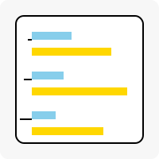

# YAMLize!



## Description

Write YAML files to create website pages

## How to use it

1. Create a new yaml file defining what you want to see in the page. See ./declarations for the available fields
2. Add the new path in the [Navbar](https://github.com/Aj-vrod/yamlize/blob/main/src/components/Navbar.tsx#L3) (This will be automated soon)
3. Run the server with:

```
npm run dev
```
